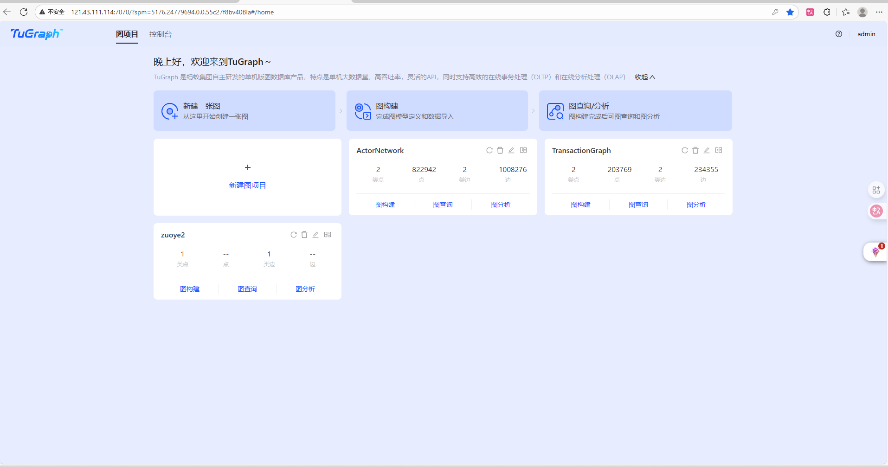
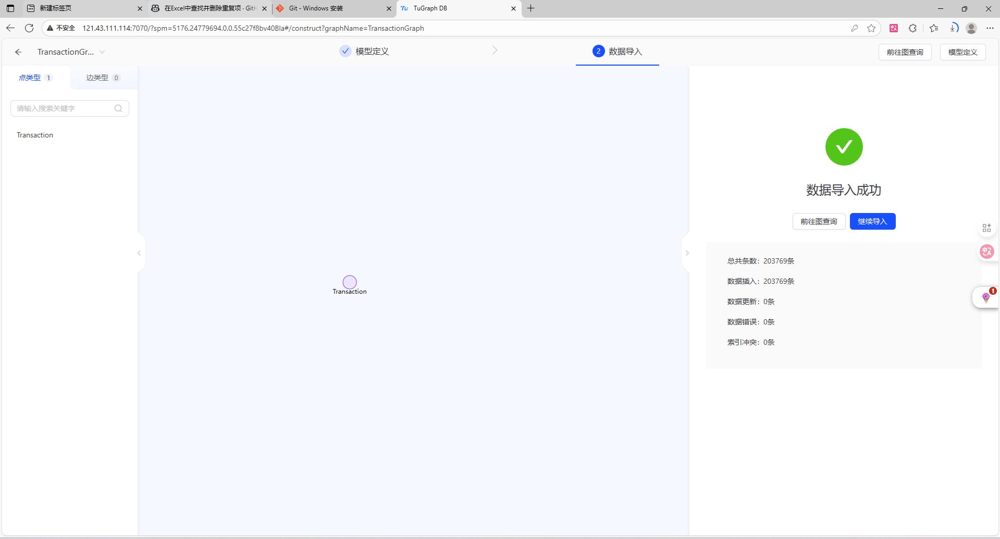
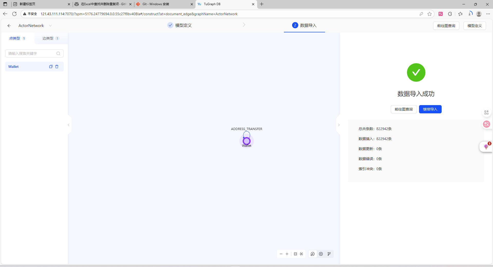
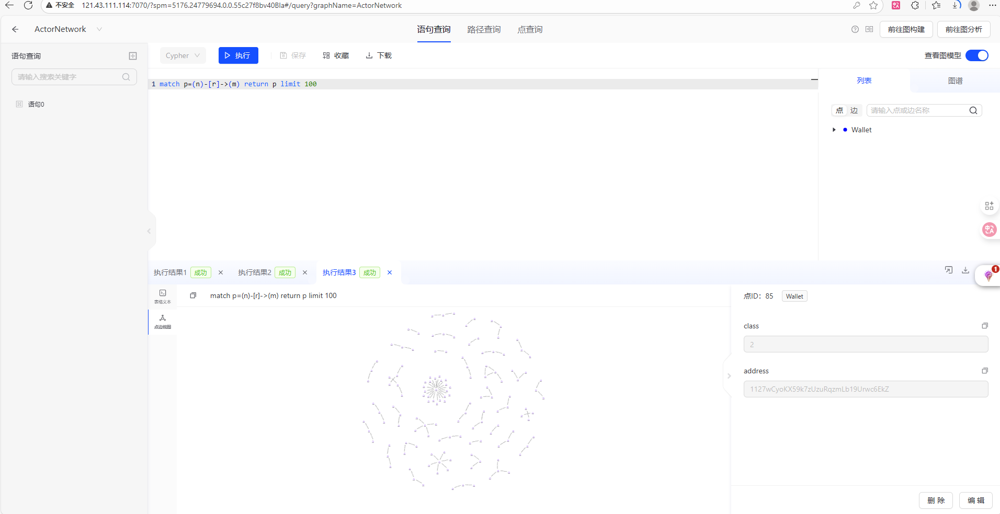
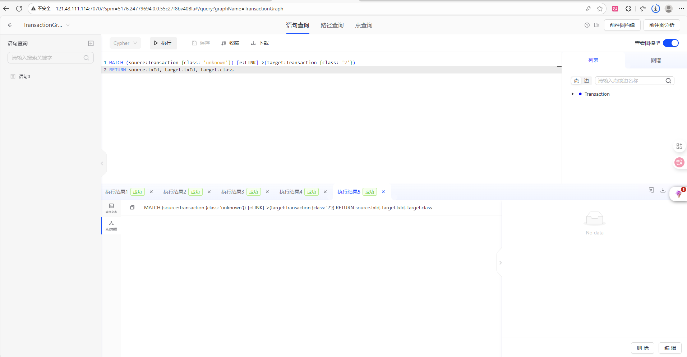
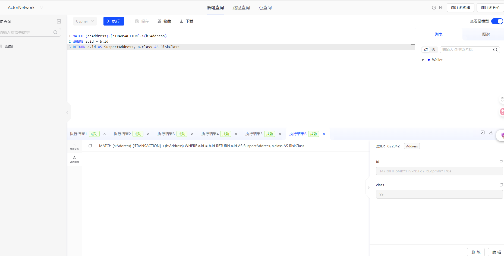

# My-Blockchain-experiment
📊 区块链交易图谱可视化项目 | 中央财经大学   ▶️ TuGraph图数据库实战：   • 双数据集建模（Transactions/Actors）   • 数据导入流程详解 + 成功操作截图   • Cypher增删改查示例（带实际业务场景）   📝 符合课程要求的实验文档与代码仓库
## 1. 实验基础知识

### 1.1 图数据库 (Graph Database)
图数据库是一种以“图论”为基础的数据管理系统。与传统的关系型数据库（RDBMS）不同，图数据库将数据存储为**节点 (Nodes)** 和**边 (Edges)**。
*   **优势：** 在处理复杂关系（如社交网络、资金流转、区块链交易）时，图数据库能提供比 SQL 更高效的查询性能，避免了复杂的多表 Join 操作。
*   **应用场景：** 金融风控、反洗钱 (AML)、推荐系统、知识图谱。

### 1.2 TuGraph 平台
TuGraph 是由蚂蚁集团开源的高性能图数据库。它具备万亿级图数据处理能力，支持标准 Cypher 查询语言，非常适合用于金融场景下的海量交易图谱分析。本次实验使用 TuGraph 的 Web 可视化控制台进行操作。

### 1.3 数据集准备
本次实验使用了两个典型的图数据集：
1.  **Transactions Dataset (交易数据集):**
    *   `txs_classes.csv`: 定义了节点信息（如交易账户的类别：非法、合法、未知）。
    *   `txs_edgelist.csv`: 定义了边信息（账户之间的转账关系、时间戳）。
2.  **Actors Dataset (参与者数据集):**
    *   `wallets_classes.csv`: 钱包地址及其属性。
    *   `AddrAddr_edgelist.csv`: 地址之间的交互关系。

---

## 2. 启动 TuGraph 平台

### 2.1 启动步骤
1.  在终端（Terminal）中运行 TuGraph 服务端程序。
    ```bash
    # 启动命令示例
    ./lgraph_server -d run
    ```
2.  服务启动成功后，在浏览器中访问可视化控制台地址（通常为 `http://localhost:7070`）。
3.  输入默认用户名 `admin` 和密码 `73@TuGraph` 进行登录。
note:以上是已在本地部署TuGraph的启动步骤，作者使用阿里云计算巢提供免费试用的网页版。

### 2.2 系统登录成功截图


---

## 3. Transactions Dataset 图建模与导入

### 3.1 图模型设计 (Schema)
针对区块链交易数据，设计如下图模型：
*   **节点 (Vertex):** `Account` (属性包括 class, txId 等)
*   **边 (Edge):** `Transfer` (属性包括 txId1, txId2 等)

### 3.2 数据导入步骤
1.  进入图构建页面，创建名为 `Bitcoin_Graph` 的子图。
2.  上传 `txs_classes.csv` 映射为 `Account` 节点，指定主键 ID。
3.  上传 `txs_edgelist.csv` 映射为 `Transfer` 边，指定 Source ID 和 Destination ID。
4.  点击“导入数据”并等待完成。

### 3.3 数据导入成功截图


---

## 4. Actors Dataset 图建模与导入

### 4.1 图模型设计
针对钱包参与者数据，设计如下图模型：
*   **节点 (Vertex):** `Wallet` (钱包地址)
*   **边 (Edge):** `Address` (地址间的交互)

### 4.2 数据导入步骤
1.  创建新的子图 `Actors_Graph`。
2.  导入 `wallets_classes.csv`，定义节点属性。
3.  导入 `AddrAddr_edgelist.csv`，建立地址间的关联边。
4.  验证数据完整性。

### 4.3 数据导入成功截图
*(注：此处展示 Actors 数据集导入后的概览界面)*


---

## 5. Cypher 语句增删改查示例

本节演示基于导入的数据集进行的 Cypher 查询操作。

### 5.1 基础查询 (READ)
**场景：** 随机查询图谱中的 10 个交易节点，查看其基本结构。
**Cypher 语句：**
```cypher
MATCH (n:Account) 
RETURN n 
LIMIT 10
查询结果截图： 
### 5.2 创建与删除 (CREATE & DELETE)
场景： 模拟发现一个新的可疑账户，将其手动添加到图谱中，随后将其删除。 Cypher 语句：

Cypher
// 1. 创建节点
CREATE (n:Account {id: 'suspicious_user_001', class: '2'}) RETURN n;

// 2. 删除该节点
MATCH (n:Account {id: 'suspicious_user_001'}) DELETE n;
操作结果截图： 

### 5.3 复杂查询 (Complex Query)
场景： 寻找特定的交易路径。查询账户 A 转账给账户 B，且账户 B 又转账给账户 C 的两跳路径（2-hop），用于追踪资金流向。 Cypher 语句：

Cypher
MATCH p = (a:Account)-[e1:Transfer]->(b:Account)-[e2:Transfer]->(c:Account)
RETURN p
LIMIT 5
查询结果截图： 